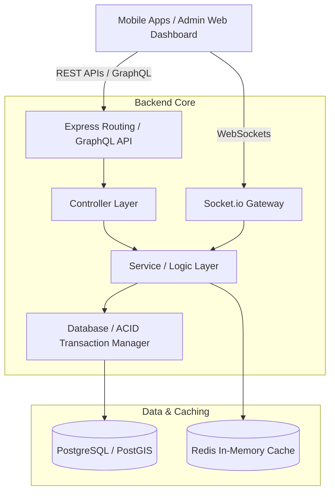

# Production Architecture & Design Blueprint

This document details the production-ready system architecture of **Fundi Service Tanzania**. The system is built on **Clean Architecture** patterns utilizing Node.js/Express, TypeScript, PostgreSQL, and Redis.

---

## 🏗️ Clean Architecture Overview

The system follows a modular, layer-separated structure (Controller-Service-Repository) to ensure high testability, maintenance isolation, and vertical scalability.



---

## 📂 Directory Layout

The workspace is organized into separate `frontend/` (Flutter/React) and `backend/` components.

```
fundi-service-tanzania/
├── backend/
│   ├── src/
│   │   ├── controllers/      # Extract URL inputs, authorize roles, invoke services
│   │   ├── services/         # Core business logic, signatures, payment gateway triggers
│   │   ├── models/           # Types and SQL repository abstractions
│   │   ├── routes/           # Routing configuration protected by middlewares
│   │   ├── middlewares/      # JWT guards, rate limiters, schema validators, logger
│   │   ├── sockets/          # Real-time WebSocket gateways (chat & live tracking)
│   │   ├── graphql/          # GraphQL queries, mutations, resolvers
│   │   ├── db.ts             # PostgreSQL client pool wrapper
│   │   └── index.ts          # Express HTTP server setup
│   ├── package.json
│   └── tsconfig.json
├── database/
│   ├── schema.sql            # Main production PostgreSQL tables, constraints, PostGIS indices
│   └── seed.sql              # Initial mock categories, locations, users, products
├── docs/
│   └── ARCHITECTURE.md       # High-level architecture blueprint
```

---

## ⚡ Redis Caching Namespace Design

Redis acts as a high-speed data manager to limit raw PostgreSQL lookups and track ephemeral system states.

| Namespace | Key Format | Data Structure | TTL | Purpose |
| :--- | :--- | :--- | :--- | :--- |
| **Session Blacklist** | `blacklist:token:<jwt_hash>` | String (`"revoked"`) | Match Token Exp (up to 7d) | Immediately block revoked JWTs |
| **Fundi Live GPS** | `fundi:location:<userId>` | Geospatial Hash (`GEOADD`) | 5 minutes | Low latency map trackers for ETA searches |
| **Chat Activity** | `chat:online:<userId>` | String (`"online"`) | 3 minutes | Typings & online indicators status checks |
| **Rate Limiting** | `rate:ip:<ip_address>` | Integer (Request count) | 1 minute | API rate throttling counter |
| **AI Recommendations** | `ai:rec:user:<userId>` | JSON string (Array of IDs) | 1 hour | Cache results of complex ML matching |

---

## 🌐 Real-Time Gateway Orchestration

Socket.io runs on a secure, JWT-authenticated channel. The following events and room configurations manage updates:

### 1. Handshake & Auth
- Handshake emits a `token` to the server.
- The server decodes and maps the connection socket to `req.user.id`.

### 2. Live Tracking Rooms
- Customers join room `track_<booking_id>` to receive real-time location updates of the on-the-way Fundi.
- The Fundi's client broadcasts GPS coordinate packets:
  ```json
  { "latitude": -6.7823, "longitude": 39.2612, "bookingId": "uuid" }
  ```
- Before broadcasting, coordinates undergo the **Haversine Speed validator** to detect simulated or impossibly fast spoofed paths (movement > 150 km/h is rejected).

### 3. Chat Room Orchestration
- Direct communication runs in rooms mapping `chat_id`.
- Typing status is signaled using `typing` event and target `chat_id`.
- Messages are saved directly to the database and broadcasted instantly to other participants in the room. If the receiver is offline, a background push notification is queued.
